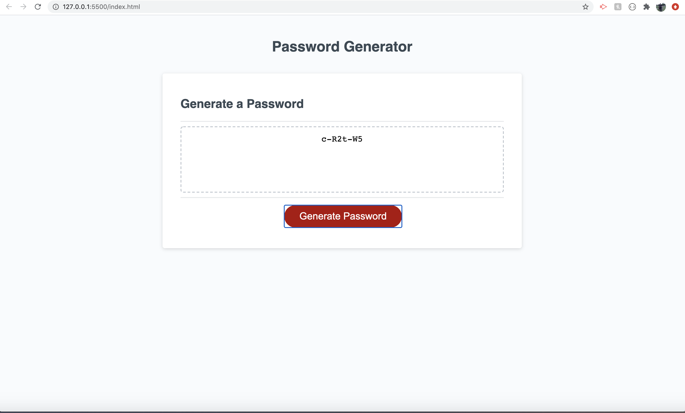

# 03 JavaScript: Password Generator

* Created prompts to ask for password length which will only continue if you choose a number between 8-128
* Created promps which ask if the user would like lower/upper case letters, numbers or symobols in password
* Once at least one of the above prompts has been answered a random password is generated 

## Links

 * https://denismatijevic.github.io/random-password-generator/
 * https://github.com/denismatijevic/random-password-generator

## Chalanges Faced

* One of the hardest thing about this assignment was figuring out exactly what each function did and how to properly write them
* I had a bit of a hard time figuring out how to make the password truly random but with some Google Fu I managed

## Screenshot 

